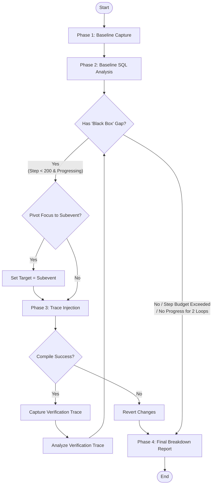

# Navigation Latency Orchestration Workflow (Swarm Orchestrator)

This skill defines the main coordination protocol, state machine, and safety
loops for the ierative latency investigation orchestrator. The Orchestrator
coordinates a swarm of specialized subagents (`TelemetryCaptureAgent`,
`SQLTraceAnalyzerInstrumentationAgent`, `TraceInjectionAgent`) to execute
targeted browser scenarios, detect uninstrumented "black boxes," and iteratively
inject C++ trace macros to break them down.

## ⚠️ CRITICAL DESIGN CONSTRAINT: NO OPTIMIZATIONS

This system is strictly designed for **data collection, diagnosis, and
instrumentation**. The Orchestrator and its subagents **MUST NOT** perform any
C++ code optimizations, caching, or refactoring. All code changes are
exclusively restricted to injecting `TRACE_EVENT` macros to expose
uninstrumented latency gaps.

______________________________________________________________________

## 1. Orchestrator Input Contract

The Orchestrator is initiated with:

- `chrome_binary`: Path to the built Chrome executable (e.g.
  `out/Default/chrome`).
- `scenario`: The Telemetry UI story name to run (e.g. `omnibox:search`).
- `target_slice`: The entrypoint trace event to investigate (e.g.
  `OmniboxEditModel::OpenMatch`).
- `arg_key` (Optional): Argument key to filter the root `target_slice`.
- `arg_value` (Optional): Argument value to filter the root `target_slice`
  (requires `arg_key`).
- `parent_session_id`: Unique UUID for grouping all the artifacts.

______________________________________________________________________

## 2. Swarm Coordination Protocol (The Loop)

The Orchestrator manages the execution across the following phases:



The ochestrator should avoid conducting the trace collection, analysis or code
edit itself. Instead, it should define subagents to perform these tasks.

### Phase 0: Subagent Definition

At the start of the execution, the Orchestrator must define the specialized
subagents:

1. **TelemetryCaptureAgent** (Trace Collection Subagent): Runs the
   \[automated-tracing\](file:///usr/local/google/home/gjc/chromium/src/agents/skills/automated-tracing/SKILL.md)
   skill to execute the Telemetry benchmark and collect Perfetto traces.
2. **SQLTraceAnalyzerInstrumentationAgent** (Trace Analyzer Subagent): Runs the
   \[analyzing-sql-traces\](file:///usr/local/google/home/gjc/chromium/src/agents/skills/analyzing-sql-traces/SKILL.md)
   skill to extract raw trace data from Perfetto traces and identify performance
   bottlenecks, structural redundancies, and tracer gaps.
3. **TraceInjectionAgent** (Trace Injection Subagent): Runs the
   \[latency-instrumentation\](file:///usr/local/google/home/gjc/chromium/src/agents/skills/latency-instrumentation/SKILL.md)
   skill to surgically inject trace macros (TRACE_EVENT) into Chromium C++ files
   and compile the browser.

### Phase 1: Git Isolation & Initial Baseline Capture

1. **Git Branch Isolation:** Before making any code modifications, the
   Orchestrator must checkout a new isolated local branch from the current
   commit.
   ```bash
   git checkout -b e2e_nla_{parent_session_id}
   ```
   DO NOT try to checkout to the main branch since the current commit might
   include new traces and optimizations.
2. Spawn the `TelemetryCaptureAgent` subagent to execute the Telemetry
   benchmark.
3. Pass parameters: `scenario`, `chrome_binary`, and `parent_session_id`.
4. Wait for the subagent to return:
   ```json
   { "status": "SUCCESS", "trace_file_path": "out/e2e_nla_run_{id}/capture/artifacts/run_{ts}/.../trace.pb" }
   ```

### Phase 2: Baseline SQL Trace Analysis

1. Spawn the `SQLTraceAnalyzerInstrumentationAgent` subagent.
2. Pass parameters: `trace_file_path`, `focus_slice_name` (which is the
   `target_slice`), `parent_session_id`, and optional `arg_key`/`arg_value` (if
   initial filters were provided).
3. Wait for the analyzer to complete and read the generated outputs:
   - `out/e2e_nla_run_{id}/analysis/trace_analysis_results.json`
   - `out/e2e_nla_run_{id}/analysis/trace_analysis_dispatch_report.md`

### Phase 3: The Iterative Tracer Gap Loop (Focus Stack & Dynamic Termination)

The Orchestrator runs an iterative loop that continues dynamically until either
we exceed the total budget (**200 agent steps**) or we detect **no progress for
2 consecutive iterations** on the active focus slice.

- **The Focus Stack (Push & Pop):** To navigate complex critical paths, the
  Orchestrator maintains a **Focus Stack** of targets (each target consists of a
  slice name and optional argument filters):
  - *Initialize:* `focus_stack = [target_slice]` (where `target_slice` is the
    root user-provided event, optionally with `arg_key`/`arg_value` filters).
  - *Push:* If a deep bottleneck is discovered, push the subevent (optionally
    with argument filters to isolate the specific call) onto the stack to drill
    down.
  - *Pop:* Once a subevent is successfully decomposed, pop it to return to the
    parent and resume analyzing siblings.
- **Progress Definition:** An iteration is progressing if the uninstrumented
  self-time of the targeted branch decreases or if new nested child slices are
  successfully discovered in the verification trace compared to the previous
  run.
- **No Progress Exit:** If we execute 2 consecutive loops without making
  progress on the active focus slice, we pop the stack. If the stack is empty,
  abort the loop.

For each iteration:

1. **Check Active Focus:** The active target slice is the top element of
   `focus_stack` (`active_target = focus_stack.peek()`).
2. **Check for Gaps:** Parse `trace_analysis_results.json`'s `black_boxes` and
   `bottlenecks` *under the active_target*.
3. **Evaluate Diminishing Returns & Loop Breakers:** If the most severe black
   box under the `active_target` is **< 0.2ms (200us)** or **< 1.0%** of the
   focus duration, or if the method was already attempted:
   - **Pop Stack:** The Orchestrator pops the current subevent from the
     `focus_stack`, returning the parent to the active position.
   - If the `focus_stack` is empty, terminate the loop and proceed to Phase 4.
4. **Optional Subevent Focus Push (Milestone Hop):**
   - The Orchestrator may **optionally choose to push a heavy subevent** (e.g.,
     `chrome::Navigate` or `FrameTreeNode::DidStartLoading` discovered inside
     the parent) onto the `focus_stack`.
   - When pushing a subevent, the Orchestrator should **optionally include
     specific TRACE_EVENT argument filters** (e.g., `arg_key` and `arg_value`)
     if they are needed to uniquely identify and isolate the target subevent
     call (for instance, to avoid analyzing initialization calls of the same
     method).
   - The pushed subevent (with its optional filters) becomes the new
     `active_target` for the next iterations' SQL analysis and trace injection.
5. **Select Target:** Select the highest-priority uninstrumented bottleneck
   method (strategy `"GAP_INSTRUMENTATION"`) inside the `active_target`.
6. **Spawn Trace Injection Agent:**
   - Provide: `target_method`, `instructions`, `category`, and
     `parent_session_id`.
   - Wait for compilation confirmation (which commits successfully compiled
     changes to the git branch, or resets hard to HEAD on failure).
7. **Subagent Resilience (Retry Policy):**
   - If any subagent call fails (e.g., `TraceInjectionAgent` returns `"FAILED"`,
     or `TelemetryCaptureAgent` fails to capture):
     - **First Failure:** Log the error and **immediately retry** spawning the
       same subagent with the identical payload once.
     - **Second Consecutive Failure:** Abort the loop, clean up, and proceed to
       Phase 4.
8. **Verify and Capture Deeper Trace:**
   - If compilation and injection succeed:
     - Spawn `TelemetryCaptureAgent` to capture a new verification trace
       (`trace_verification_{iteration}.pb`).
     - Spawn `SQLTraceAnalyzerInstrumentationAgent` to parse the new trace under
       the `active_target` (passing `focus_slice_name` and its associated
       `arg_key`/`arg_value` filters if present).
     - Re-read `trace_analysis_results.json` to verify the breakdown.
   - If the injection agent fails permanently (after the retry):
     - Pop the `focus_stack` (or abort loop) and proceed to Phase 4.

### Phase 4: Overall Investigation Report

Once the loop terminates, the Orchestrator composes an **Overall Investigation
Report on the user-provided root event** (the initial focus target).

1. Retrieve the baseline and all iteration trace data, text flamegraphs, and
   findings.
2. Compile the **Overall Diagnostic Investigation Report** inside the workspace:
   - Path:
     `out/e2e_nla_run_{parent_session_id}/analysis/overall_investigation_report.md`
3. The report MUST contain:
   - **Executive Summary**: Latency metrics of the root user-provided event,
     overall list of newly instrumented methods, and the cumulative
     uninstrumented gap reduction.
   - **The Tree of Discovery (Milestone Hops)**: If focus was pivoted to
     subevents (e.g., root `OpenMatch` -> pivot `Navigate`), illustrate the
     hierarchical deep-dive path. If code change are made, include the git
     branch name of the code change in the document.
   - **Baseline vs. Deep-Dive Flamegraphs**: Side-by-side text flamegraphs
     showing how the initial baseline "black boxes" under the root event were
     successfully decomposed into fine-grained, nested child operations.
   - **Structural Revelations**: A detailed architectural breakdown of the
     operations discovered blocking the main thread inside the previously hidden
     blocks (e.g. loops, observer dispatches, blocking IPCs).
4. Present the completed final report to the user.

______________________________________________________________________

## 3. Safety & Execution Budgets

The Orchestrator MUST strictly enforce these safety limits to protect the
workspace and compute budgets:

- **Swarm Step Cap**: Max **200 total steps** across all subagents.
- **Progress Watchdog**: Stop immediately if **2 consecutive iterations yield no
  progress**.
- **Subagent Resilience**: Allow exactly **1 retry** on a subagent task failure
  before aborting.
- **Execution Timeout**: Max **180 minutes** (to allow for slow Chromium
  compiles).
- **Workspace Safety Rollback**: If the entire run fails or is aborted:
  - Switch back to the main branch: `git checkout main` (or the original
    baseline branch).
  - Delete the temporary branch: `git branch -D e2e_nla_{parent_session_id}` to
    restore the developer's workspace completely untouched.
