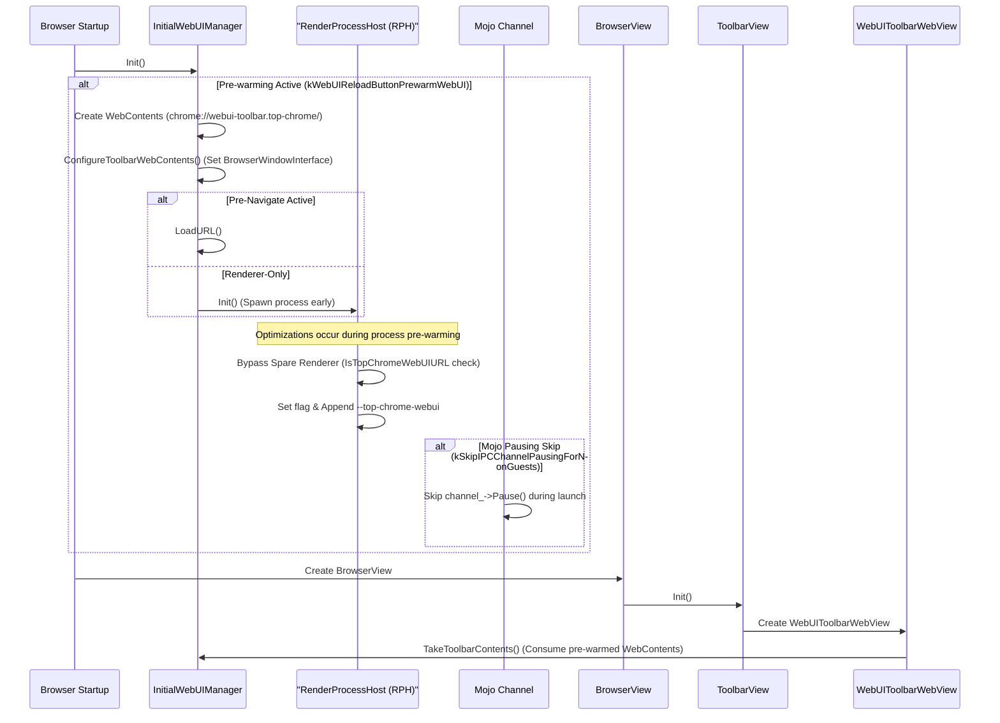
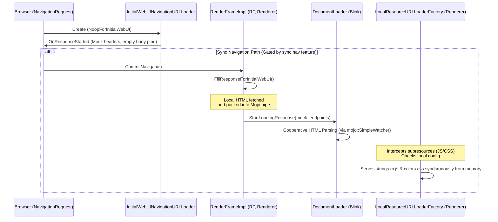
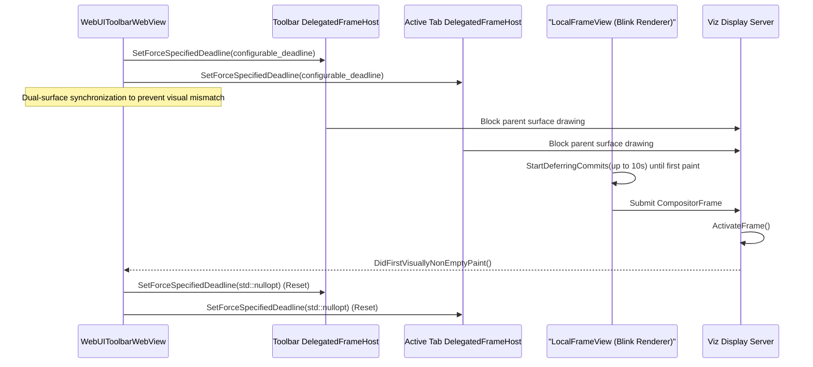
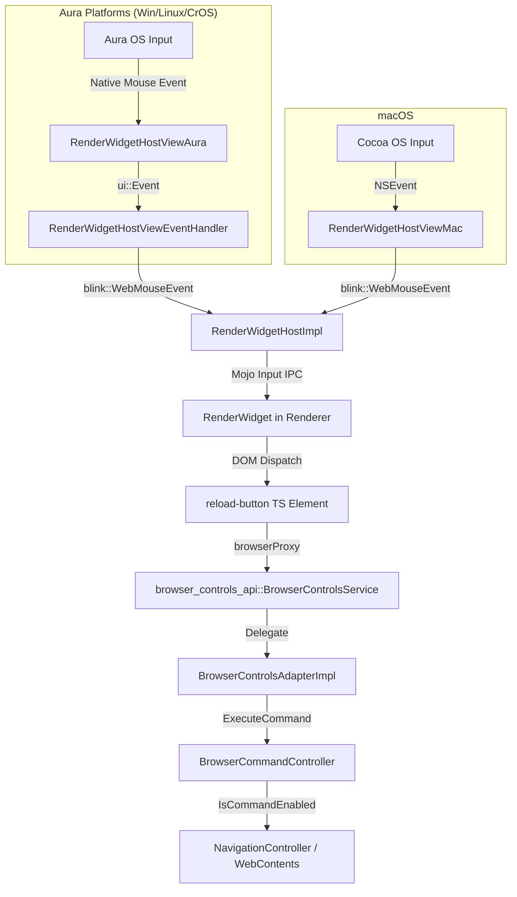

# Life of a WebUI ReloadButton

This document provides a high-level discussion of the lifecycle, architecture,
and behavior of the WebUI-based toolbar reload control
(`chrome://webui-toolbar.top-chrome/`) in Chrome. It traces the component from
initial process startup and pre-warming through navigation, resource loading,
surface synchronization, user interaction, telemetry, and crash recovery.

[TOC]

## Introduction

While a toolbar button that reloads a webpage seems simple—a user clicks, and a
tab navigates—the goal of accelerating engineering velocity has prompted an
experimental effort to transition Top Chrome toolbar controls from native C++
Views to WebUI. Under this experiment, the reload button is implemented as a Web
Component running within an isolated renderer process. This trial aims to
leverage standard web technologies to achieve cross-platform UI code reuse,
enable dynamic layouts, and facilitate rapid frontend iteration. If successful,
developers can write layout and style logic once and deploy it across all
desktop platforms, bypassing the complex, platform-specific layouts of native
Views code.

To make this WebUI button feel as responsive and integrated as a native C++
Views control, Chrome's **Initial WebUI** infrastructure must address several
unique constraints:

*   **Zero-latency perception.** Users expect toolbar buttons to render
    instantly and respond to clicks without delay. Chrome cannot wait for
    network requests or standard process launch cycles when a window opens.
*   **Visual synchronization.** Because the toolbar is part of the native
    browser window frame, it must render in sync with the rest of the UI. Any
    delay or visual mismatch (such as a blank space where the reload button
    should be) is unacceptable.
*   **Process isolation.** Top Chrome WebUIs handle privileged operations and
    must be strictly isolated from standard web content renderer processes to
    maintain Chrome's security model.
*   **Resource efficiency.** While we want instant responsiveness, we must avoid
    wasting CPU and memory by preloading too many resources or keeping unused
    renderer processes alive.

Chrome coordinates multiple systems across the Browser, Renderer, and Viz
processes to meet these requirements.

### What does this document cover?

This document walks through the lifecycle of the WebUI reload button, detailing:

*   **Process Initialization:** Spawning the dedicated renderer process early
    during browser startup.
*   **Navigation Lifecycle:** Intercepting navigation with a mock loader.
*   **Resource Loading:** Serving page resources synchronously from local
    memory.
*   **Surface Synchronization:** Coordinating compositor deadlines to prevent
    visual glitches.
*   **User Interaction:** Routing OS input events to the WebUI renderer.
*   **Command Execution:** Handling Mojo commands and executing native browser
    actions.
*   **Telemetry:** Monitoring performance and logging paint timing.
*   **Crash Recovery:** Restoring the UI if the renderer crashes.

Each phase is discussed at a high level, describing the subsystems that handle
each step and how they communicate with each other.

### What does this document not cover?

The following related topics are outside the scope of this overview:

-   **Standard WebUIs.** Standard non-Top-Chrome WebUIs (e.g.,
    `chrome://settings`) that use standard network and resource loading paths.
-   **WebUI guest embedding.** Host-guest embedding architectures using
    `SurfaceEmbed` or iframe-based designs.
-   **General toolbar layout.** Layout details or command routing unrelated to
    the WebUI reload button control.

### Chromium Concepts

To help outside developers, the following definitions describe the core systems
involved in this architecture:

*   **Views**: Chrome's native C++ cross-platform UI toolkit.
*   **Mojo**: Chrome's cross-process Inter-Process Communication (IPC) system.
*   **WebContents**: The core container representing an individual page or UI
    surface.
*   **Aura / Cocoa**: Aura is the windowing and event handling subsystem on
    Windows/Linux/ChromeOS. Cocoa is the native macOS UI framework.
*   **Viz**: Chrome's graphics compositor service that receives visual
    compositor frames and draws them to the screen.
*   **Web Components & Lit**: The frontend technologies used to build the
    toolbar UI.
*   **RenderProcessHost (RPH)**: The browser-side representation of a renderer
    process.
*   **RenderFrameImpl (RF)**: The renderer-side implementation of a frame (e.g.,
    a main frame or iframe).

### System Architecture

The following diagram illustrates the interactions and Inter-Process
Communication (IPC) connections between the browser, renderer, and Viz processes
involved in routing events, synchronizing surfaces, and loading resources for
the WebUI reload button.

```mermaid
graph TD
    classDef browser fill:#e8f0fe,stroke:#1a73e8,stroke-width:2px;
    classDef renderer fill:#fce8e6,stroke:#d93025,stroke-width:2px;
    classDef viz fill:#e6f4ea,stroke:#188038,stroke-width:2px;
    classDef input fill:#fef7e0,stroke:#f29900,stroke-width:2px;

    subgraph "Input Layer"
        OS["OS Input System (Aura / Cocoa)"]:::input
    end

    subgraph "Browser Process"
        IWUM[InitialWebUIManager]:::browser
        WV[WebUIToolbarWebView]:::browser
        BCS[BrowserControlsService]:::browser
        BCAdapter[BrowserControlsAdapterImpl]:::browser
        BCC[BrowserCommandController]:::browser
        TSM[TabStripModel]:::browser
        TC_WC[Toolbar WebContents]:::browser
        AT_WC[Active Tab WebContents]:::browser
        DFH[DelegatedFrameHost]:::browser
        SMP[SubprocessMetricsProvider]:::browser
        UPLMO["UmaPageLoadMetricsObserver"]:::browser
    end

    subgraph "Renderer Process (Top Chrome WebUI)"
        RW[RenderWidget]:::renderer
        RBElement[reload-button Element]:::renderer
        BP[BrowserProxyImpl]:::renderer
        DL[Blink DocumentLoader]:::renderer
        LFV[LocalFrameView]:::renderer
        LRF[LocalResourceURLLoaderFactory]:::renderer
        MRFO[MetricsRenderFrameObserver]:::renderer
    end

    subgraph "Viz Process"
        DC[Display Compositor]:::viz
        SF["Surface / Allocation Group"]:::viz
    end

    %% Input flow
    OS -->|Native Events (Aura Event Handler / Cocoa)| WV
    WV -->|Mojo: WebInputEvent| RW
    RW -->|DOM Events| RBElement

    %% Interaction / Command flow
    RBElement -->|PressHandler (Short/Long Press / Click)| BP
    BP -->|Mojo: BrowserControlsService IPC| BCS
    BCS -->|Delegate| BCAdapter
    BCAdapter -->|ExecuteCommand| BCC
    BCC -->|IsCommandEnabled| AT_WC
    AT_WC <--> TSM

    %% Process pre-warming & resource loading
    IWUM -->|Pre-warm / RPH::Init| TC_WC
    TC_WC -->|Mock URLLoader / Commit| DL
    DL -->|Mojo SimpleWatcher (Async parsing)| LRF
    LRF -->|Local memory serve (strings, colors)| DL

    %% Surface Sync flow
    WV -->|Propagate configurable_deadline| DFH
    DFH -->|Apply to BOTH Toolbar & Active Tab| DC
    LFV -->|Defer commits| DC
    DC -->|Resolve Surface / DidPaint| WV

    %% Metrics flow
    LFV -->|Paint Presentation Feedback| MRFO
    MRFO -->|Mojo: PageLoadMetrics IPC| UPLMO
    SMP -->|IsForTopChromeWebUI| UPLMO
```

--------------------------------------------------------------------------------

## Process Initialization

To minimize startup latency, Chrome spawns the WebUI reload button's renderer
process and prepares its UI surface before the browser window is visible.

The following sequence diagram outlines how the browser initializes the
`InitialWebUIManager` during startup and configures the WebContents:



### Eager Pre-warming Modes

The `InitialWebUIManager`, owned by `BrowserWindowFeatures`, starts during
`BrowserWindowFeatures::Init()` before `BrowserView` is constructed. If the
`features::kWebUIReloadButtonPrewarmWebUI` flag is enabled, the manager creates
a `content::WebContents` for the toolbar URL
(`chrome://webui-toolbar.top-chrome/`).

The manager operates in one of two pre-warming modes:

*   **Pre-Navigate Mode:** Enabled via
    `features::kWebUIReloadButtonPrewarmWebUIPreNavigate`. The manager
    immediately initiates navigation by calling `LoadURL()`.
*   **Renderer-Only Mode:** Spawns the renderer process early by calling
    `site_instance->GetProcess()->Init()` without committing a load.

Note: In `WebUIToolbarWebView` (the Views host class),
`InitializationState::kUninitialized` indicates that the `WebContents` has not
yet completed its initial navigation. This state covers the preloaded
renderer-only path where the renderer process has spawned, but the initial URL
has not yet been loaded.

### Native Views Hierarchy Integration

The reload button is housed in the native Views-based browser toolbar. When
`features::IsWebUIToolbarEnabled()` is active, `ToolbarView::Init()`
instantiates `WebUIToolbarWebView`.

This class inherits from `views::View` and hosts `WebUIToolbarInternalWebView`
(a subclass of `views::WebView` defined in
`chrome/browser/ui/views/toolbar/webui_toolbar_web_view.cc`), which manages the
underlying `content::WebContents`. `WebUIToolbarWebView` integrates into the
`ToolbarView` layout tree using flex layouts. Bounds and visibility changes
propagate through the standard Views layout pipeline via
`UpdateButtonOverflowState()` and `ComputeLayout()`.

When `WebUIToolbarWebView` is created, it claims ownership of the pre-warmed
`WebContents` by calling `TakeToolbarContents()`, bypassing the default creation
path.

### Process Initialization Optimizations

Chrome applies two key optimizations to the renderer process during startup to
ensure it is dedicated and launched quickly:

#### Bypassing the Spare Renderer

Because Top Chrome WebUIs require strict security isolation, they do not reuse
standard spare renderer processes. When
`SpareRenderProcessHostManagerImpl::MaybeTakeSpare()` evaluates a request, it
checks `IsTopChromeWebUIURL()` and bypasses the spare renderer if it matches.

Instead, a dedicated process is spawned. During initialization in
`RenderProcessHostImpl::CreateRenderProcessHost()`, Chrome sets the
`RenderProcessFlags::kForTopChromeWebUI` flag. The browser subprocess command
line (`AppendRendererCommandLine()`) detects this flag and appends the
`--top-chrome-webui` command-line switch to the child process.

#### Skipping IPC Channel Pausing

Normally, Mojo channels are paused during child process launch to prevent
premature message dispatch before the process is initialized. However, when
`features::kSkipIPCChannelPausingForNonGuests` is enabled for Top Chrome WebUIs,
`ShouldPauseChannelUntilProcessLaunched()` returns `false`. This allows early
Mojo interface requests to be queued and dispatched to the renderer immediately
upon launch, saving valuable milliseconds.

### Window Binding

During eager creation of the WebContents, the browser establishes contextual
bindings to the native browser window. `ConfigureToolbarWebContents()` binds the
native `BrowserWindowInterface` to the newly created `WebContents` using
`webui::SetBrowserWindowInterface()`, enabling the WebUI frontend to interact
with window-level controls.

### Early GPU Channel Establishment

To eliminate the startup latency of requesting a GPU channel, Chrome bypasses
the traditional approach where a newly launched renderer process blocks its main
thread waiting for a synchronous IPC response from the browser. Instead, the
browser pre-establishes the GPU channel early during process creation. During
[`RenderProcessHostImpl::Init()`][RPH_Init], if the process is dedicated to a
Top Chrome WebUI, the browser proactively initializes the GPU channel with the
Viz compositor process via
`gpu_client_->InitializeGpuChannelForNewRenderer(...)`. The resulting Mojo
message pipe is then attached directly to the renderer's Mojo invitation under
the attachment name `kGPUChannelAttachmentName`. On the renderer side, the child
process extracts this pre-established GPU channel pipe during early startup in
[`ChildThreadImpl::Init()`][ChildThread_Init] from the incoming Mojo invitation.
The renderer's main thread then takes ownership of the pipe via
[`RenderThreadImpl::TakeInitialGPUChannel()`][RenderThread_TakeGPU] to
instantiate the Viz `Gpu` client. This proactive push completely eliminates the
post-launch IPC round-trip latency to establish the GPU channel, allowing the
WebUI to start compositing frames immediately.

### Extensions Bypass

Standard [content::WebContents][WebContents] instances normally load multiple
extension-related scripts and observers, demanding substantial CPU and memory
during their critical startup phase. To alleviate this overhead, Chrome
implements an extension bypass gated by the
`blink::features::kInitialWebUIWithoutExtensions` feature flag. During process
creation, [`OnRenderProcessHostCreated()`][OnRenderProcessHostCreated] and
[`OnRenderProcessLaunched()`][OnRenderProcessLaunched] skip early extension
initialization for Top Chrome processes. Furthermore, during navigation,
[ExtensionWebContentsObserver] completely ignores the Initial WebUI navigation,
ensuring that no extension frames, bindings, or content scripts are loaded in
the renderer, which drastically reduces CPU and memory usage.

### Spellcheck Bypass

In a similar vein of startup optimization, Chrome implements a spellcheck bypass
gated by the `features::kInitialWebUIWithoutSpellCheck` feature flag. During
renderer initialization,
[`SpellcheckService::InitForRenderer()`][Spellcheck_Init] checks this flag and
returns early, entirely skipping Hunspell dictionary loading, custom word list
compilation, and the associated IPC messages to the renderer. By bypassing these
setup steps, the main thread avoids potential blocking operations, ensuring a
swifter path to rendering the toolbar UI.

--------------------------------------------------------------------------------

## Navigation Lifecycle

Once the renderer process is initialized, Chrome commits the navigation to the
reload button URL. To bypass network stack latency and standard IPC round-trips,
the page and its resources are loaded entirely in-process.

The following sequence diagram illustrates the mock navigation loader and local
resource factory workflow:



### Intercepting Navigation with a Mock Loader

When navigation to `chrome://webui-toolbar.top-chrome/` begins,
`NavigationRequest::OnStartChecksComplete()` intercepts the request and sets the
loader type to `kNoopForInitialWebUI`.

This routes the navigation to `InitialWebUINavigationURLLoader::Start()`. This
mock loader bypasses Chrome's network stack entirely. It retrieves the page's
data source from the browser's `URLDataManagerBackend`, constructs mock HTTP
response headers, and immediately invokes `OnResponseStarted`. This callback
returns a null client endpoint and an empty data pipe for the response body,
signaling that the content will be loaded locally.

### Synchronous Navigation Commit

To ensure the reload button is available instantly when the browser window is
shown, the navigation timeline bypasses the traditional asynchronous steps of
standard web pages. In a standard navigation, the browser-side
`NavigationRequest` runs various throttles, triggers a network or body load,
waits for the renderer process to be ready, and then asynchronously requests the
renderer to commit the navigation. For the Initial WebUI reload button, however,
this entire sequence is condensed into a single synchronous flow.

The journey of this synchronous commit begins with the browser-side
`NavigationRequest` bypassing the throttle registry entirely. During throttle
setup, [`RegisterNavigationThrottles()`][NTR_RegisterThrottles] and its
counterpart for commits without a URL loader return early if the navigation is
marked as an initial WebUI sync navigation. This bypass is enforced by strict
assertions, ensuring that no throttles can be registered or run, thereby
eliminating all throttle-related overhead. Next, inside
[`NavigationRequest::StartNavigation()`][NavReq_Start], the browser skips the
creation of commit and process selection deferrers, preventing any asynchronous
pause during the early phases of navigation.

To load the page without network overhead, the browser avoids the Network
Service entirely. When creating the URL loader, the navigation request
instantiates [InitialWebUINavigationURLLoader]—a mock loader gated by the
`kNoopForInitialWebUI` loader type—which immediately returns synthetic HTTP
headers. With all throttles, deferrals, and network loaders bypassed, the
browser process commits the navigation immediately. Inside
[`OnWillProcessResponseChecksComplete()`][NavReq_ChecksComplete], Chrome detects
the synchronous navigation status and immediately executes the commit, making
the `NavigationRequest` go from construction to
[`RenderFrameImpl::CommitNavigation()`][RFI_CommitNavigation] synchronously,
finally hitting an async step when instructing the renderer to commit.

Finally, the commit request reaches the renderer process. Upon receiving the
instruction in [`RenderFrameImpl::CommitNavigation()`][RFI_CommitNavigation],
the renderer intercepts the path and calls
[`RenderFrameImpl::FillResponseForInitialWebUI()`][RFI_FillResponse]. This
method reads the HTML document body locally from memory, wraps it in a local
Mojo data pipe, and immediately completes the loading sequence. By keeping the
entire navigation loop local and synchronous, Chrome guarantees that the reload
button's frame is ready to paint without a single asynchronous context switch or
network hop.

## Resource Loading

To achieve instant rendering, the WebUI reload button's resource loading process
is partitioned between the browser and renderer processes. The **Browser
process** compiles and pre-generates these resources (such as localized strings
and theme colors) during browser startup, sending them to the renderer as a
static configuration snapshot (`LocalResourceLoaderConfig`) via Mojo during the
navigation commit phase. The **Renderer process**'s local factory
(`LocalResourceURLLoaderFactory`) then intercepts all subresource requests and
serves them directly from this in-memory snapshot, bypassing the network stack
and traditional Inter-Process Communication (IPC) round-trips.

### Cooperative HTML Parsing

Once the response starts, Blink’s `DocumentLoader::StartLoadingResponse()`
processes the HTML data pipe. Rather than blocking the main thread synchronously
for the entire parse duration, Blink uses a `mojo::SimpleWatcher` to watch the
data pipe. Parsing runs cooperatively and asynchronously on the main thread,
yielding execution to prevent UI unresponsiveness.

### Subresource Loading Overrides

To handle subresources like scripts and stylesheets without browser round-trips,
`RenderFrameImpl::MaybeSetUpLocalResourceLoader()` instantiates a
`LocalResourceURLLoaderFactory` on a background task runner. This factory
overrides the renderer's default subresource loader.

When a subresource request occurs, the factory intercepts it and checks the
configuration mapping. If the requested URL matches a key in the local
configuration, the resource is served directly from memory. Otherwise, it falls
back to a standard browser-based request.

### In-Process Resource Loading V2 Pipeline

The mechanism for serving local subresources utilizes the In-Process Resource
Loading V2 pipeline, which enables the renderer to serve dynamically generated,
in-memory resources directly. When the renderer requests a WebUI subresource,
such as a JavaScript module or a stylesheet, [LocalResourceURLLoaderFactory]
intercepts the request. The factory first performs local checks via
[`LocalResourceURLLoaderFactory::CanServe()`][LRF_CanServe] to determine if the
resource exists within the pre-generated configuration's response map or the
memory-mapped `resources.pak` bundle. If the resource cannot be served locally,
the factory transparently falls back to the browser-process WebUI loader.

If the resource is available locally, the factory avoids blocking the renderer's
main thread by offloading the work. It posts the loading task,
[`LocalResourceURLLoaderFactory::GetResourceAndRespond()`][LRF_GetResource] to a
background [base::ThreadPool] sequence. On this background thread, the loader
retrieves the raw resource bytes from the memory-mapped bundle. If the resource
requires localization or dynamic branding, the loader performs in-process
template and internationalization replacements before packaging the final
payload. Once the processed bytes are ready, they are streamed back to the
client asynchronously through
[`URLLoaderClient::OnStartLoadingResponseBody()`][ULC_OnStart]. This local,
off-threaded pipeline ensures that subresource loading remains incredibly fast
and completely isolated from the main thread's rendering duties.

#### Mojo IPC Configuration Structures

The in-process resource loader is configured using Mojo structures defined in
`local_resource_loader_config.mojom`:

*   `LocalResourceLoaderConfig`: Sent from the browser to the renderer,
    containing a map of origin keys to `LocalResourceSource` values.
*   `LocalResourceSource`: Contains response headers, replacement string
    templates, and a map of relative resource paths to their corresponding
    `LocalResourceValue` for a given origin.
*   `LocalResourceValue`: A Mojo Union representing the actual resource payload
    (e.g., compiled JSON-to-JS localization modules or custom CSS color
    palettes).

When a subresource request is intercepted,
[`LocalResourceURLLoaderFactory::GetResourceAndRespond()`][LRF_GetResource]
fetches the pre-generated `response_body` string from the configuration,
packages it into a Mojo data pipe, and streams it asynchronously to the client
via [`URLLoaderClient::OnStartLoadingResponseBody()`][ULC_OnStart].

Note: The `LocalResourceLoaderConfig` is serialized and sent to the renderer
exactly once during the navigation commit phase. Consequently, the renderer's
`LocalResourceURLLoaderFactory` is initialized with a static snapshot of
resources. If the browser subsequently updates dynamically generated resources
(e.g., color themes), the active factory does not receive these updates. To
apply them, the page must be reloaded.

### Frontend Binding

The frontend code is built using Web Components written in TypeScript:

*   `<toolbar-app>`: The root application component
    (`chrome/browser/resources/webui_toolbar/app.ts`).
*   `<reload-button>`: The specific reload control component
    (`chrome/browser/resources/webui_toolbar/reload_button.ts`).
*   `BrowserProxyImpl`: The Mojo interface wrapper
    (`chrome/browser/resources/webui_toolbar/browser_proxy.ts`).

During startup, `BrowserProxyImpl` binds Mojo remotes to the browser services:
`browserControlsHandler` connects to `BrowserControlsService` and
`toolbarUIHandler` connects to `ToolbarUIService`. The `<toolbar-app>` component
registers a `ToolbarUIObserverCallbackRouter` to receive push updates from the
browser, propagating state shifts (such as changing between "reload" and "stop"
states) down to the `<reload-button>`.

--------------------------------------------------------------------------------

## Surface Synchronization

To prevent the browser UI from showing visual glitches or a blank toolbar, the
rendering of the WebUI must be synchronized with the native Views surface. This
ensures the reload button appears fully rendered as soon as the toolbar is
displayed.

The following sequence diagram shows the dual-surface synchronization flow
between the WebView, DelegatedFrameHost, Blink Renderer, and the Viz Display
Server:



### Dual-Surface Synchronization

To prevent visual mismatch between the native Chrome UI and the WebUI page
during initialization, `WebUIToolbarWebView` implements dual-surface
synchronization. When the WebView is attached to the widget,
[`WebUIToolbarWebView::ApplyInitialSurfaceSyncDeadline()`][WebView_Deadline]
resolves a deadline override from
`features::kInitialWebUISurfaceSyncDeadlineInFrames` (expressed as a
`configurable_deadline` count of frames).

Rather than only delaying the WebUI's own frame commit,
`WebUIToolbarWebView::SetSurfaceSyncDeadline` propagates this deadline override
to:

*   The toolbar WebUI's own [WebContents].
*   The active tab's [WebContents], retrieved via
    `BrowserView::GetActiveWebContents()`.

By forcing `cc::DeadlinePolicy::UseSpecifiedDeadline(configurable_deadline)` on
the [DelegatedFrameHost] of both surfaces, Viz blocks the drawing of the parent
browser compositor surface. This ensures that the toolbar and the active tab are
presented in perfect lockstep, entirely preventing a flash of half-drawn chrome
elements juxtaposed against a blank or partially rendered page.

### Paint Holding

On the renderer side, [`DocumentLoader::CommitNavigation()`][DocLoader_Commit]
enables paint holding for the Initial WebUI frame. While paint holding is
normally restricted for regular web pages, it is explicitly allowed on the
`chrome://` scheme for the TopChrome toolbar. Paint holding prevents the
renderer from swapping to a blank frame or drawing incomplete layout segments.

### Compositor Deferral

To coordinate with paint holding,
[`LocalFrameView::BeginLifecycleUpdates()`][LocalFrameView_Lifecycle] calls
`StartDeferringCommits()` on the compositor thread. Instead of relying on the
standard 500ms timeout, the compositor thread extends the commit deferral limit
to the value of `kInitialWebUISurfaceSyncRendererCommitDelayInMs`. This gives
the renderer ample time to perform layout and resource parsing, preventing the
submission of blank frames to Viz while layout and resource parsing are ongoing.

### Resolving Surfaces in Viz

Once the initial layout is complete, paint holding is released, and the renderer
submits a completed `CompositorFrame` to the Viz display server. Viz performs
dependency checks in `Surface::UpdateActivationDependencies()` to ensure that
all embedded surfaces are ready before activating the frame.

To avoid display deadlocks if parent frames lag behind during activation, Viz
checks if a newer active surface within the allocation group satisfies the
sequence range when `features::kBypassOutdatedSurfaceActivation` is active. If
this condition is met, Viz treats the dependency as satisfied and proceeds with
activation, preventing the UI from freezing.

Once dependencies resolve, Viz activates the frame and fires the
`DidFirstVisuallyNonEmptyPaint()` callback to the browser process. Upon
receiving this callback, the browser's `WebUIToolbarWebView` calls
`SetSurfaceSyncDeadline(std::nullopt)`. This resets the forced deadline on the
`DelegatedFrameHost`, returning the compositor to standard, non-blocking
deadlines for subsequent frame updates.

### Design Limitation: Active Tab Swapping

A critical design limitation exists within this synchronization mechanism:
`WebUIToolbarWebView` does not observe the `TabStripModel`.

If a user switches tabs (e.g., via keyboard shortcuts or mouse clicks) after the
deadline override has been applied but before the first visually non-empty paint
occurs:

*   The newly selected active tab will *not* participate in surface
    synchronization and will render with standard, non-blocking compositor
    deadlines.
*   The previous active tab (now in the background) retains the stale
    `configurable_deadline` override, delaying background resource updates or
    tab discarding actions unnecessarily.

--------------------------------------------------------------------------------

## User Interaction

When a user interacts with the reload button, input events route from the native
operating system layer into the WebUI's DOM.

The following diagram illustrates input routing and command flow across
processes:



### Routing Input to the WebUI Renderer

Unlike out-of-process iframes, the toolbar WebUI is embedded directly into the
native Views UI hierarchy using `views::WebView`. This component wraps a
`views::NativeViewHost` to embed the native window of the `RenderWidgetHostView`
directly as a child of the native toolbar.

Input events follow different platform-specific pathways before reaching the
common renderer event dispatcher:

*   **Aura Platforms (Windows, Linux, and ChromeOS):** Aura routes OS mouse
    events directly to the child window.
    `RenderWidgetHostViewEventHandler::OnMouseEvent()` intercepts the
    `ui::MouseEvent`, translates it into a `blink::WebMouseEvent`, and forwards
    it to `RenderWidgetHostImpl`. Keyboard focus is redirected via
    `views::WebView::OnFocus()`, with `RenderWidgetHostViewAura::OnKeyEvent()`
    translating Aura keyboard events for Blink.
*   **macOS:** Mac bypasses Aura, using a native Cocoa view hierarchy. OS inputs
    (`NSEvent`) are intercepted by `RenderWidgetHostViewMac` (and its helper
    `RenderWidgetHostViewCocoa`), translated into Blink events, and sent to
    `RenderWidgetHostImpl`.

Regardless of the platform, the finalized events are dispatched to the renderer
via the Mojo `WidgetInputHandler` interface.

### Frontend Gesture Disambiguation

The `<reload-button>` element handles pointer and keyboard interactions using
distinct listeners to resolve gesture collisions:

*   **Pointer Gestures:** To distinguish between short and long presses, the
    element listens to `@pointerdown` and `@pointerup` events. It uses a helper
    class called `PressHandler`. Upon `@pointerdown`, `PressHandler` starts a
    500ms timer.
    *   If `@pointerup` fires before the timer expires, it is registered as a
        short press, invoking `onShortPress_()`.
    *   If the timer expires without a pointer-up event, it is treated as a long
        press, triggering the navigation history menu.
*   **Keyboard Activation:** When a user activates the button using the keyboard
    (e.g., Tab focus + Space or Enter), the browser fires a standard click event
    where the event details field `e.detail` is `0`. The component listens to
    `@click` separately, and if `e.detail === 0`, it routes the request directly
    to `onShortPress_()`.

Depending on the state when `onShortPress_()` is invoked, the action is split:

*   **Active Tab is Loading:** The button acts as a stop button, calling
    `this.browserProxy_.browserControlsHandler.stopLoad()`.
*   **Active Tab is Idle:** The button acts as a reload button, calling
    `this.browserProxy_.browserControlsHandler.reloadFromClick(bypass_cache,
    disposition)` (where disposition is `WindowOpenDisposition`, which defines
    how the page should open, e.g., current tab or new window).

## Command Execution

When the frontend triggers a command, it is routed via Mojo back to the browser
process for native execution.

### Mojo Command Routing

Mojo calls from `BrowserProxyImpl` are transmitted across the Mojo interface
`browser_controls_api::mojom::BrowserControlsService` (defined in
`components/browser_apis/browser_controls/browser_controls_api.mojom`).

The direct receiver of this interface in the browser process is
`browser_controls_api::BrowserControlsService`. It implements the Mojo interface
and acts as a router, immediately delegating commands to
`BrowserControlsAdapterImpl` via the `BrowserControlsAdapter` C++ interface.

### Executing Commands in the Browser

`BrowserControlsAdapterImpl` maps the Mojo requests to Chrome's native C++
command IDs (prefixed with `IDC`, e.g., `IDC_RELOAD`):

*   `reloadFromClick()` maps to `IDC_RELOAD` (or `IDC_RELOAD_BYPASSING_CACHE` if
    cache bypass is requested).
*   `stopLoad()` maps to `IDC_STOP`.

Before executing any action, the adapter forwards the command to
`BrowserCommandController::IsCommandEnabled(command_id)` to verify that the
active window and user profile permit the action (e.g., checking if the
navigation controller is currently blocked or if reloading is disabled by
enterprise policy).

If enabled, the adapter invokes
`BrowserCommandController::ExecuteCommandWithDisposition(command_id,
disposition)`. The controller executes the native navigation actions:

*   `IDC_RELOAD` calls `chrome::Reload()`, triggering
    `active_web_contents->GetController().Reload()`.
*   `IDC_STOP` calls `chrome::Stop()`, triggering `active_web_contents->Stop()`.

--------------------------------------------------------------------------------

## Telemetry

Chrome tracks the performance and stability metrics of the WebUI reload button
to ensure responsiveness and detect regression trends.

### Logging Paint Timing Metrics

When the compositor paints the WebUI, Blink's rendering pipeline triggers
`PaintTiming::NotifyPaint()`. The propagation of this paint timing metric is
asynchronous: it waits for presentation feedback from the Viz display compositor
to confirm that the frame has been physically drawn to the display.

Only after receiving this Viz presentation feedback does Blink update the
document's performance timing registry via
`DocumentLoader::DidChangePerformanceTiming()`. The `MetricsRenderFrameObserver`
detects this update. If `IsForInitialWebUI()` evaluates to `true`, the observer
packages the absolute timestamp (`base::TimeTicks`) and dispatches it to the
browser via the `PageLoadMetrics::UpdateTiming()` Mojo IPC interface.

The browser's `InitialWebUIPageLoadMetricsObserver` intercepts this IPC and
routes the metrics to the `InitialWebUIWindowMetricsManager`, which uses the
`WaapUIMetricsService` to log the first paint time to User Metrics Analysis
(UMA) histograms (such as `InitialWebUI.ReloadButton.FirstPaint`).

### Startup Paint Timing Alignment

To ensure a seamless user experience, Chrome monitors the alignment between the
appearance of the native browser window and the rendering of the WebUI-based
reload button. The `WaapUIMetricsService` logs two key startup paint metrics:

*   `InitialWebUI.Startup.BrowserWindow.FirstPaint`: Tracks the time from
    application start to the native browser window's first presentation.
*   `InitialWebUI.Startup.ReloadButton.FirstPaint`: Tracks the time from
    application start to the WebUI reload button's first paint.

The `InitialWebUIWindowMetricsManager` coordinates these metrics by receiving
timestamps from two sources. It receives the window presentation timestamp via
`BrowserView::OnFirstPresentation()` and the reload button paint timestamp via
`InitialWebUIPageLoadMetricsObserver`.

Using these timestamps, the manager calculates a delta metric:
`InitialWebUI.Startup.BrowserWindowToReloadButton.FirstPaintGap`. This metric
measures the time difference between the two paint events. Aligning these
metrics to minimize this gap is critical; if the native window presents before
the reload button is painted (resulting in a positive gap), the user will see a
blank space in the toolbar where the button should be, causing a noticeable
visual glitch.

### Merging Subprocess Metrics

Histograms recorded inside the WebUI renderer process are periodically merged
into the browser's central metrics database using
`SubprocessMetricsProvider::MergeHistogramDeltasFromAllocator()`.

During process initialization, the `SubprocessMetricsProvider` registers the
allocator for the subprocess. It identifies Top Chrome WebUI renderer processes
by checking if `RenderProcessHost::IsForTopChromeWebUI()` returns true (rather
than checking `IsWebiumRenderer()`).

### Filtering Subprocess Metrics

To prevent background WebUI navigations from skewing global Core Web Vitals,
Chrome filters WebUI metrics via the `MetricsNameMapper`:

*   If a metric matches the rules in `features::kWebiumMetricsMappingConfig`,
    the mapper prepends the `Webium.` prefix (e.g., converting
    `Navigation.DocumentLoader.DidCommitNavigation` to
    `Webium.Navigation.DocumentLoader.DidCommitNavigation`).
*   Unmatched metrics from the subprocess allocator are dropped entirely to keep
    standard user metrics clean.

> [!IMPORTANT] **Architectural Note: Browser-Side Metrics Leakage** The
> `MetricsNameMapper` only filters and maps metrics generated *within the WebUI
> renderer subprocess*. Browser-side observers, such as
> `UmaPageLoadMetricsObserver`, listen directly in the browser process for Mojo
> IPCs sent by the renderer frame (e.g. `PageLoadMetrics::UpdateTiming()`).
> Because these observers execute and record metrics directly in the browser
> process, they bypass the `MetricsNameMapper` filters entirely, causing some
> WebUI metrics to leak into standard browser-side metrics if not specifically
> ignored by the observer class.

### Perfetto Tracing Category

To aid in debugging startup latency and rendering performance, Chrome utilizes a
dedicated Perfetto tracing category named `"waap"` (defined in
`base/trace_event/builtin_categories.h`). This category is specifically
allocated for instrumentation and performance tracing of Webium-as-a-Product
(WaaP) experiments, including the WebUI reload button.

The `WaapUIMetricsService::EmitHistogramWithTraceEvent()` method leverages this
category to bracket the logging of key UMA metrics within named Perfetto trace
slices. By inserting `TRACE_EVENT_BEGIN("waap", ...)` and
`TRACE_EVENT_END("waap", ...)` around metric registration and execution events,
developers can visually correlate these UMA metric events with broader browser
startup phases and Viz display compositor timelines when analyzing Perfetto
trace files.

--------------------------------------------------------------------------------

## Crash Recovery

If the WebUI renderer process crashes, the browser runs recovery cycles to
restore the toolbar UI.

The browser catches the failure via
`WebUIToolbarWebView::PrimaryMainFrameRenderProcessGone(status)`. The web view
tracks consecutive crashes using an internal `crash_count_` counter. If the time
elapsed since the last crash exceeds
`kWebUIReloadButtonCrashRecoverResetInterval` (default 10 seconds), this counter
resets to zero.

Depending on the crash frequency, the browser reacts as follows:

*   **Within Recovery Limits:** If `crash_count_` is less than or equal to
    `kWebUIReloadButtonMaxCrashRecoveryTimes` (default 3), the browser schedules
    an asynchronous task to reload the page. Crucially, Chrome does not destroy
    or recreate the heavyweight `content::WebContents` object. Instead, the
    `WebContents` remains alive, and a standard navigation reload (`Reload()`)
    is executed. This reload triggers the creation of a new renderer process and
    `RenderFrameHost` to host the WebUI.
*   **Exceeded Recovery Limits:** If the counter exceeds the limit, the browser
    logs `InitialWebUI.Toolbar.RenderProcessGoneExceedingRecoveryLimit` and
    schedules a delayed retry task to execute after 1 minute
    (`kWebUIReloadButtonCrashRecoverRetryInterval`).

Currently, there is no fallback mechanism to show a native C++ Views button if
the WebUI process fails to recover. Although the code contains a `TODO` to
revert to a native C++ views button view, this fallback is not yet implemented.

[LRF_GetResource]: https://crsrc.org/c/content/renderer/local_resource_url_loader_factory.cc
[ULC_OnStart]: https://crsrc.org/c/services/network/public/mojom/url_loader.mojom
[RPH_Init]: https://crsrc.org/c/content/browser/renderer_host/render_process_host_impl.cc
[ChildThread_Init]: https://crsrc.org/c/content/child/child_thread_impl.cc
[RenderThread_TakeGPU]: https://crsrc.org/c/content/renderer/render_thread_impl.cc
[WebContents]: https://crsrc.org/c/content/public/browser/web_contents.h
[OnRenderProcessHostCreated]: https://crsrc.org/c/extensions/browser/renderer_startup_helper.cc
[OnRenderProcessLaunched]: https://crsrc.org/c/extensions/browser/renderer_startup_helper.cc
[ExtensionWebContentsObserver]: https://crsrc.org/c/extensions/browser/extension_web_contents_observer.h
[Spellcheck_Init]: https://crsrc.org/c/chrome/browser/spellchecker/spellcheck_service.cc
[NTR_RegisterThrottles]: https://crsrc.org/c/content/browser/renderer_host/navigation_throttle_registry_impl.cc
[NavReq_Start]: https://crsrc.org/c/content/browser/renderer_host/navigation_request.cc
[InitialWebUINavigationURLLoader]: https://crsrc.org/c/content/browser/webui/initial_webui_navigation_url_loader.h
[NavReq_ChecksComplete]: https://crsrc.org/c/content/browser/renderer_host/navigation_request.cc
[RFI_CommitNavigation]: https://crsrc.org/c/content/renderer/render_frame_impl.cc
[RFI_FillResponse]: https://crsrc.org/c/content/renderer/render_frame_impl.cc
[LocalResourceURLLoaderFactory]: https://crsrc.org/c/content/renderer/local_resource_url_loader_factory.h
[LRF_CanServe]: https://crsrc.org/c/content/renderer/local_resource_url_loader_factory.cc
[base::ThreadPool]: https://crsrc.org/c/base/task/thread_pool.h
[WebView_Deadline]: https://crsrc.org/c/chrome/browser/ui/views/toolbar/webui_toolbar_web_view.cc
[DelegatedFrameHost]: https://crsrc.org/c/content/browser/renderer_host/delegated_frame_host.h
[DocLoader_Commit]: https://crsrc.org/c/third_party/blink/renderer/core/loader/document_loader.cc
[LocalFrameView_Lifecycle]: https://crsrc.org/c/third_party/blink/renderer/core/frame/local_frame_view.cc
